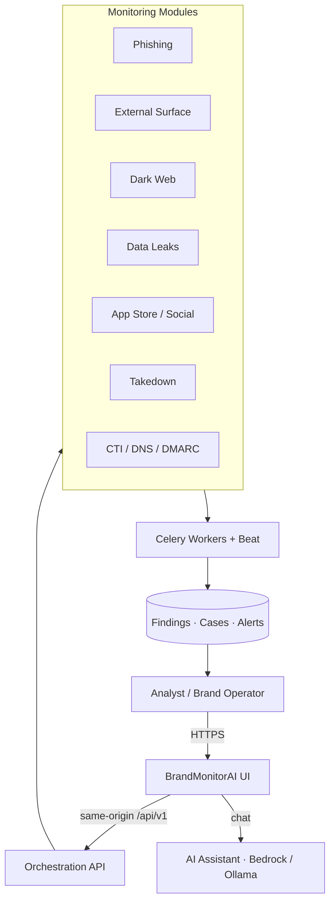

<div align="center">

# 🛡️ _BrandMonitorAI — Brand Protection & Security Monitoring_

### _AI-Assisted Brand Protection, Threat Intelligence & Digital Risk Monitoring for the Modern Enterprise_

<br />


<br />

<em>[BrandMonitorAI](https://brandmonitor.zeroshield.ai), a core module of <a href="https://zeroshield.ai">ZeroShield</a></em>

<br />

<a href="https://opensource.org/licenses/MIT"></a>


### 🚀 [Open BrandMonitorAI](https://brandmonitor.zeroshield.ai) · [Explore ZeroShield](https://zeroshield.ai)

</div>

---

## Table of Contents

- [About BrandMonitorAI](#about-brandmonitorai)
- [Core Mission](#core-mission)
- [The Digital Brand Risk Challenge](#the-digital-brand-risk-challenge)
- [Key Capabilities](#key-capabilities)
- [Platform Access](#platform-access)
- [Platform Architecture](#platform-architecture)
- [Target Users](#target-users)
- [Feature Overview](#feature-overview)
- [Example Workflows & User Benefits](#example-workflows--user-benefits)
- [Use Cases](#use-cases)
- [Getting Started (Short)](#getting-started-short)
- [Documentation](#documentation)
- [Support](#support)
- [Get Involved](#get-involved)

---

## About BrandMonitorAI

**BrandMonitorAI** is an enterprise brand-protection and digital-risk monitoring platform within the **[ZeroShield](https://zeroshield.ai)** ecosystem. It unifies phishing detection, dark-web intelligence, data-leak exposure, app-store and social impersonation, DNS/DMARC trust, attack-surface discovery, CTI dashboards, and AI-assisted triage into one operator workspace.

Instead of juggling multiple OSINT tools, ticket spreadsheets, and disconnected scanners, BrandMonitorAI converts fragmented brand and cyber signals into **investigate → validate → case → takedown / alert** workflows that SOC, abuse, and AppSec teams can run every day.

**Live platform:** [https://brandmonitor.zeroshield.ai](https://brandmonitor.zeroshield.ai)

> This repository is the **official public documentation** for BrandMonitorAI (documentation-first, same model as other ZeroShield product repos). Application source code remains private.

---

## Core Mission

Give every brand-facing security team a single pane of glass to **detect impersonation early, prove exposure with evidence, and respond with auditable workflows** — reducing customer fraud, reputation damage, and mean-time-to-takedown across the open web, app stores, social channels, and the dark web.

---

## The Digital Brand Risk Challenge

Modern brands face a continuous attack surface that traditional perimeter tools were never designed to watch:

| Challenge | What it means operationally |
| :--- | :--- |
| **Lookalike & phishing domains** | Fraud sites clone login pages within hours of a campaign or product launch |
| **Credential & data leaks** | Employee or customer emails appear in breach corpora and underground dumps |
| **Dark-web brand chatter** | Mentions of your brand, VIP emails, or internal tools surface in forums and channels |
| **App-store & social impersonation** | Fake apps and support accounts steal trust before customers notice |
| **Email trust failures** | Weak DMARC / DNS posture enables domain spoofing and BEC at scale |
| **Fragmented tooling** | Analysts lose time pivoting across SpiderFoot, VT, urlscan, Excel, and Slack with no case trail |

BrandMonitorAI is built to address these challenges in one coordinated platform.

---

## Key Capabilities

- 🕵️ **Phishing Detection** — URL and batch hunts with optional LLM validation
- 🌐 **External Surface Monitoring (ASM)** — attack-surface discovery and classification
- 🕳️ **Dark Web Monitoring** — scheduled brand monitoring, source health, review queue
- 💧 **Data Leak Monitoring** — breach/email exposure checks and optional local corpora
- 📱 **App Store Monitoring** — lookalike / impersonation tracking across stores
- 👥 **Social Media Monitoring** — fake accounts and brand-abuse detection
- 😊 **Brand Sentiment** — perception analysis across web, news, and video sources
- 📡 **DNS & DMARC Monitoring** — email authentication and DNS posture visibility
- ⚡ **Active / Passive Monitoring** — recon and scan orchestration for monitored assets
- 🧭 **CTI Dashboard** — threat-intel overview with optional Kibana embeds
- 🛡️ **Takedown Monitoring** — enrichment, evidence packs, and request lifecycle tracking
- 🤖 **AI Chat Assistant** — in-product guidance scoped to BrandMonitorAI workflows
- 📁 **Cases, Alerts & Audit** — case handoff, Slack/email dispatch, append-only audit trail

---

## Platform Access

### Product Access

- **Open the platform:** [https://brandmonitor.zeroshield.ai](https://brandmonitor.zeroshield.ai)
- **Enterprise / partner onboarding:** contact [support@zeroshield.ai](mailto:support@zeroshield.ai)

### Documentation Scope

This public repository contains product documentation, architecture overviews, operator guides, and ZeroShield branding assets. It does **not** publish proprietary application source.

---

## Platform Architecture

BrandMonitorAI follows an **orchestrator pattern**: analysts work in a Next.js dashboard; FastAPI owns domain APIs; Celery executes long-running and scheduled scans.



**Description:** End-to-end flow from analyst actions through orchestration APIs and async workers into findings, cases, and alerts that feed the operator dashboard.

> Deeper diagrams: [`docs/architecture.md`](docs/architecture.md)

---

## Target Users

### **SOC / Threat Analysts**
*Investigate brand abuse and external threats with evidence, not screenshots alone.*

**Real World Scenario:** Meera is a Tier-2 SOC analyst at a retail bank. Overnight monitoring flags three lookalike domains cloning the bank’s mobile login. In BrandMonitorAI she opens **External Surface** + **Phishing Detection**, confirms shared infrastructure and risky URL features, attaches VirusTotal / urlscan enrichment from **Takedown**, and creates a case with severity Critical. Slack alerts fire automatically. By morning standup the abuse desk already has an evidence pack — and a customer-facing phishing domain is queued for registrar action before peak banking hours.

### **Brand Protection / Abuse Desk**
*Own impersonation, fake apps, and social fraud from discovery to closure.*

**Real World Scenario:** Arjun leads brand protection for a national e-commerce brand during festive-sale season. Fake seller apps and “support” Instagram accounts spike. Using **App Store Monitoring** and **Social Media Monitoring**, he inventories lookalikes, tags confirmed impersonators, and tracks takedown requests in **Takedown Monitoring**. **Brand Sentiment** shows rising negative chatter tied to a fraudulent cash-on-delivery scam. Leadership gets a weekly PDF narrative instead of an unstructured spreadsheet dump — and repeat offenders are prioritized for escalation.

### **CISOs & Security Leadership**
*Demonstrate continuous brand-risk coverage with measurable response workflows.*

**Real World Scenario:** Sunita, CISO at a fintech, must answer a board question: “How do we know if our brand is being abused underground?” She enables scheduled **Dark Web** and **Data Leak** jobs, wires executive Slack channels for high severity, and reviews the **CTI Dashboard** weekly. When a VIP executive email appears in a leak corpus, BrandMonitorAI surfaces it with case context — not three days later in a vendor PDF. The next cyber-insurance questionnaire has concrete tooling, alerting, and audit evidence.

### **AppSec / Security Engineers**
*Connect brand monitoring to DNS trust, recon, and technical validation.*

**Real World Scenario:** Vikram, AppSec engineer at a SaaS company, onboards a newly acquired product brand. He runs **DMARC** and **DNS** assessments, starts **Active/Passive Monitoring** for core domains, and schedules dark-web brand jobs. When DMARC is still `p=none`, he opens a remediation ticket before marketing launches a campaign. Continuous monitoring fills the gap between quarterly pen tests.

### **Marketing / Trust & Safety Partners**
*Act on reputation and customer-trust signals without running scanners yourself.*

**Real World Scenario:** Neha in Trust & Safety notices a surge of “official support” complaints. She asks BrandMonitorAI’s **AI Chat** how to investigate social impersonation, follows the guided path into Social + Sentiment modules, and hands a curated suspect list to Security. No tool credentials required on her side — response stays coordinated.

---

## Feature Overview

The platform is organised into operator modules. Each module supports investigation, enrichment, and handoff into cases / takedowns / alerts.

### 1. Dashboard & AI Assistant
Instant operator landing page plus an embedded assistant scoped to BrandMonitorAI workflows (what to scan, which module to use, how to interpret banners).

### 2. Phishing Detection
Hunt single URLs or batches; validate suspicious pages; push confirmations into cases.

> **Scenario:** A QR-code campaign drives traffic to a lookalike host. Analysts batch-check shortlinks before customer reports pile up.

### 3. External Surface Monitoring (ASM)
Discover and classify external footprint tied to a brand or domain for rapid expansion of the investigation scope.

> **Scenario:** A new product subdomain appears in the wild; ASM reveals related infrastructure used by an impersonation cluster.

### 4. Dark Web Monitoring
Scheduled and on-demand brand monitoring with source health, optional Tor-backed depth, review queue, and case promotion.

> **Scenario:** Mentions of an upcoming product codename appear in underground channels; analysts triage before GA.

### 5. Data Leak Monitoring
Detect email/domain exposure via breach intelligence integrations and optional local corpora.

> **Scenario:** Contractor mailboxes appear in a fresh dump; security forces password resets before account takeover.

### 6. App Store & Social Media Monitoring
Find fake apps and impersonating social identities that monetize your brand trust.

> **Scenario:** A clone Android app collects prepaid KYC photos; brand desk documents store listings for rapid notices.

### 7. Brand Sentiment
Track perception shifts across web, news, and video — useful for linking abuse campaigns to reputation impact.

### 8. DNS & DMARC Monitoring
Surface spoofing risk and email authentication gaps that enable BEC and brand phishing.

> **Scenario:** Missing rua reporting and weak policy leave a newly acquired brand vulnerable; engineers remediate before a mailer blast.

### 9. Active / Passive Monitoring
Technical monitoring workflows for assets under watch (recon, scanning orchestration, exports).

### 10. CTI Dashboard
Executive and analyst CTI views (optional Kibana embeds) for broader threat context.

### 11. Takedown Monitoring
Enrich threats, generate evidence-oriented outputs, and track request/lifecycle status through resolution.

### 12. Cases, Alerts & Audit
Promote findings into tracked work, notify channels (Slack/email/webhooks), and retain auditable history.

---

## Example Workflows & User Benefits

### Workflow A — Phishing outbreak to takedown
1. Detection via Phishing / ASM  
2. Enrichment in Takedown (urlscan / VT / Safe Browsing where configured)  
3. Case creation + Slack alert  
4. Abuse desk drives registrar / hoster action  
5. Audit trail retained for post-incident review  

**Benefit:** Hours — not days — from first sighting to coordinated response.

### Workflow B — Leak exposure to containment
1. Data Leak monitor flags VIP / customer emails  
2. Analyst validates and opens a case  
3. Identity team resets / steps up MFA  
4. Leadership receives severity-aware notifications  

**Benefit:** Contained credential risk before fraud desks see losses.

### Workflow C — Festive-season brand abuse desk
1. App Store + Social monitors invent ory lookalikes  
2. Sentiment shows customer confusion spike  
3. Priority queue for takedown notices  
4. Weekly exec summary from platform exports  

**Benefit:** Marketing and Security stay aligned with shared evidence.

---

## Use Cases

### Financial Services & Banking
Stop lookalike banking portals, UPI/payment phishing, and dark-web chatter around carding or VIP emails — with case evidence for regulators and fraud ops.

### E-commerce & Retail
Hunt fake storefront apps, fraudulent “support” accounts, and coupon/phishing campaigns during sales peaks; measure sentiment fallout in parallel.

### SaaS & Technology Brands
Monitor product domains, API docs impersonation, developer-tool lookalikes, and leak exposure of employee identities after acquisitions or launches.

### Healthcare & Life Sciences
Protect patient-facing portals and brand trust; watch for phishing that harvests credentials to clinical or billing systems.

### Fintech & Payments
Combine DMARC/DNS hardening with continuous phishing and leak monitoring for high-value transaction brands.

### Enterprises with Shared Services / Conglomerates
Run multi-brand monitoring under one operating model — shared SOC playbooks, separate case streams, consistent alerting.

---

## Getting Started (Short)

> Product source is private. Use the live platform for day-to-day work. This repo holds documentation only.

| Step | Action |
| :--- | :--- |
| 1 | Open **[brandmonitor.zeroshield.ai](https://brandmonitor.zeroshield.ai)** |
| 2 | Sign in with your organisation account (or request access via Support) |
| 3 | Start from **Dashboard** → run a module relevant to your alert (Phishing, Dark Web, Data Leaks, …) |
| 4 | Promote confirmed threats to **Cases / Takedown** and enable alert channels |

**Operators & partners** who need deeper setup, Docker, env vars, or API notes: see [`docs/`](docs/) (kept deliberately out of the main narrative).

```bash
git clone https://github.com/developing1dreams/BrandMonitorAI-Docs.git
cd BrandMonitorAI-Docs
```

---

## Documentation

| Guide | Purpose |
| :--- | :--- |
| [`docs/README.md`](docs/README.md) | Full docs index |
| [`docs/architecture.md`](docs/architecture.md) | Architecture & pillars |
| [`docs/usage.md`](docs/usage.md) | Module operator walkthrough |
| [`docs/api.md`](docs/api.md) | API overview |
| [`docs/deployment.md`](docs/deployment.md) | Production notes |
| [`docs/troubleshooting.md`](docs/troubleshooting.md) | Common issues |
| [`docs/runbook.md`](docs/runbook.md) | Incident checklists |

---

## Support

- 📧 **General contact:** [vartul@zeroshield.ai](mailto:vartul@zeroshield.ai)
- 📧 **Support queries:** [support@zeroshield.ai](mailto:support@zeroshield.ai)
- 🌐 **Platform:** [https://brandmonitor.zeroshield.ai](https://brandmonitor.zeroshield.ai)
- 🌐 **ZeroShield:** [https://zeroshield.ai](https://zeroshield.ai)

---

## Get Involved

Improvements to public documentation are welcome. See [`docs/contributing.md`](docs/contributing.md).

For enterprise access, demos, and partnership inquiries, contact [support@zeroshield.ai](mailto:support@zeroshield.ai).

---

## License

This documentation is licensed under the **MIT License** — see [`LICENSE`](LICENSE).

---

> **Value Proposition:** [BrandMonitorAI](https://brandmonitor.zeroshield.ai) turns fragmented brand-abuse signals into a single, AI-assisted operating system for detection, investigation, and takedown — so ZeroShield customers protect customers and reputation before damage scales.

---

*BrandMonitorAI, a part of [ZeroShield](https://zeroshield.ai).*

All rights reserved. This documentation is the intellectual property of [ZeroShield](https://zeroshield.ai).
