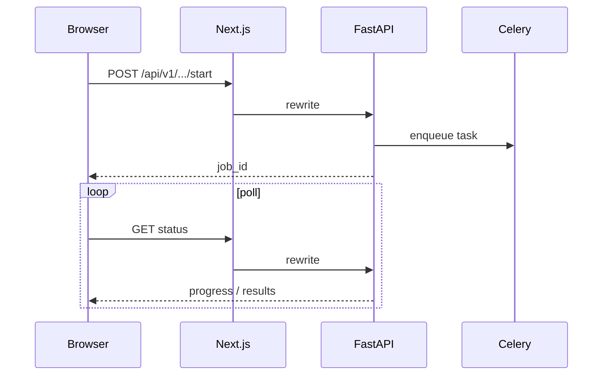

# API Documentation

The orchestration API is a **FastAPI** application registered in `orchestration-backend/api/main.py` under the `/api/v1` prefix.

## Interactive docs

With the stack running:

| Surface | URL |
| :--- | :--- |
| Swagger UI (via Next rewrite) | http://localhost:9002/docs |
| OpenAPI JSON | http://localhost:9002/openapi.json |
| Direct backend (Compose binds localhost) | http://127.0.0.1:8000/docs |

Production: `https://brandmonitor.zeroshield.ai/docs` (when exposed through the same rewrite pattern).

## Health & integrations

```http
GET /api/v1/health/ready
GET /api/v1/health/integrations
```

`integrations` returns which upstream keys are enabled vs disabled (no secret values).

## Primary router groups

| Tag / area | Router | Example endpoints |
| :--- | :--- | :--- |
| Dashboard | `dashboard` | `GET /api/v1/dashboard/overview` |
| Monitoring | `monitoring` | `POST /api/v1/monitor/start` |
| External surface | `external_surface` | `POST /api/v1/external-surface/scan` |
| Data leaks | `data_leaks` | `GET /api/v1/data-leaks/summary` |
| Dark web | `dark_web` | `POST /api/v1/dark-web/scan` |
| Takedown | `takedown` | `POST /api/v1/takedown/request` |
| Phishing | `phishing` | `POST /api/v1/phishing/scan` |
| App store | `app_store` | `POST /api/v1/app-store/search` |
| DMARC | `dmarc` | `POST /api/v1/dmarc/analyze` |
| DNS | `dns` | `POST /api/v1/dns/monitor` |
| Social media | `social_media` | `POST /api/v1/social-media/scan` |
| Brand sentiment | `brand_sentiment` | `POST /api/v1/brand-sentiment/analyze` |
| CTI | `cti` | `GET /api/v1/cti/overview` |
| Cases / alerts / audit | `cases`, `alerts`, `audit` | CRUD + stats |
| AI | `ai`, `librechat` | Chat / provider helpers |
| Auth (API) | `auth` | Token helpers under `/api/v1/auth` |

Exact paths evolve with the codebase — treat Swagger as the source of truth.

## Async job pattern

Most scans:

1. `POST` start → `{ job_id }` (or task id)
2. Poll status endpoint until complete
3. Optional `GET` export CSV/JSON



## Error model

Upstream/config failures prefer typed responses (e.g. **503** with `detail.error` such as `integration_not_configured`) rather than opaque 500s. The UI maps these to `<IntegrationBanner />`.

## Auth planes

| Plane | Path | Owner |
| :--- | :--- | :--- |
| Web login / OAuth | `/api/auth/*` | Next.js (NextAuth + custom routes) |
| Orchestration APIs | `/api/v1/*` | FastAPI (JWT / org dependencies where applied) |
| Chat completions | `/api/librechat/*` | Next.js → Bedrock / Ollama |

Middleware (`src/middleware.ts`) redirects unauthenticated browser traffic away from protected pages.
