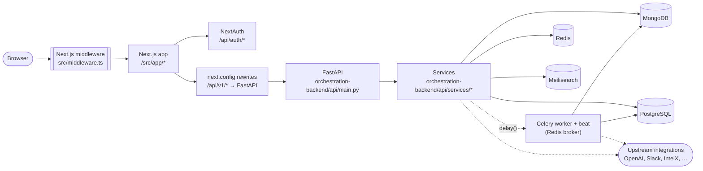
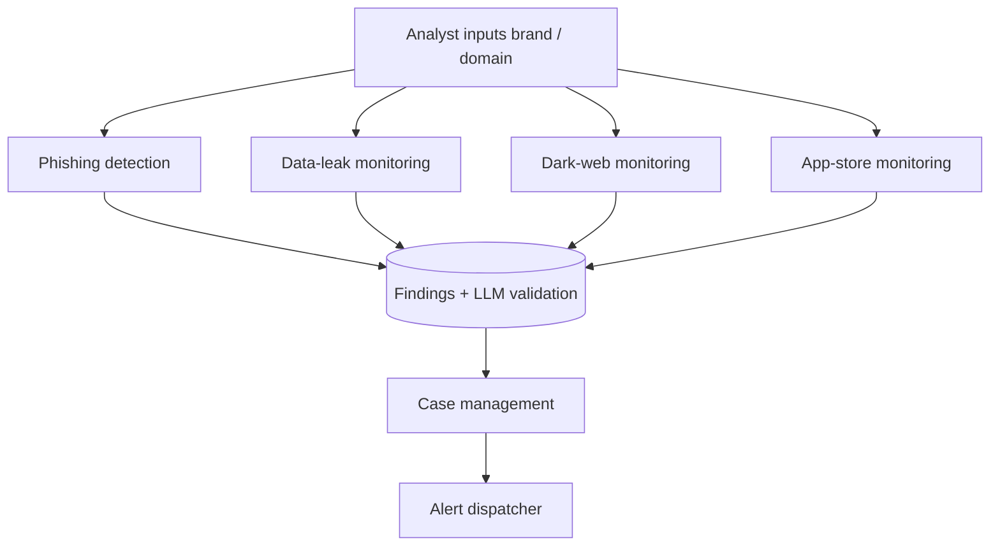
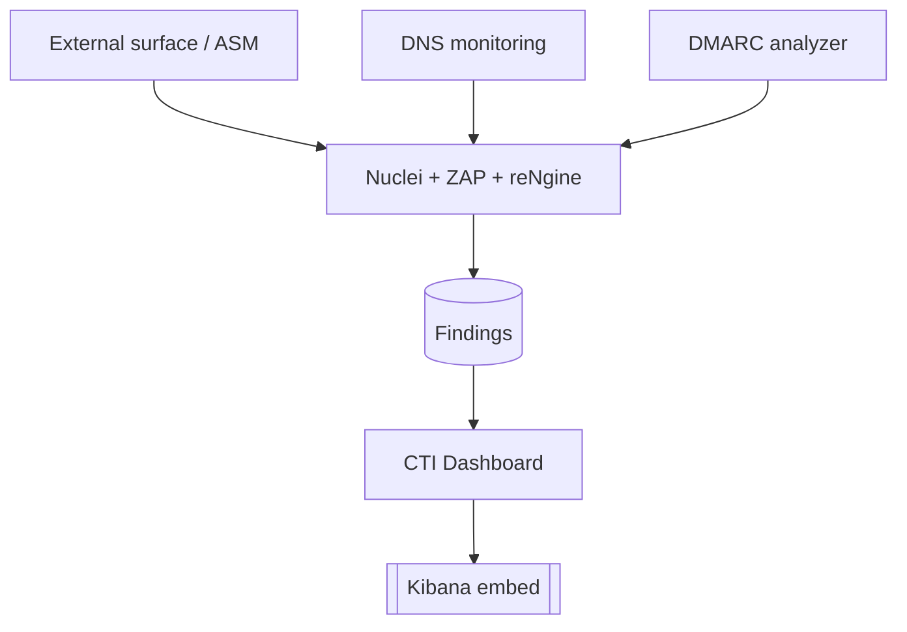
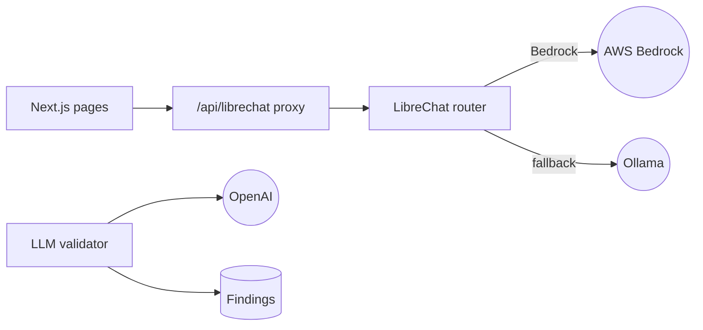
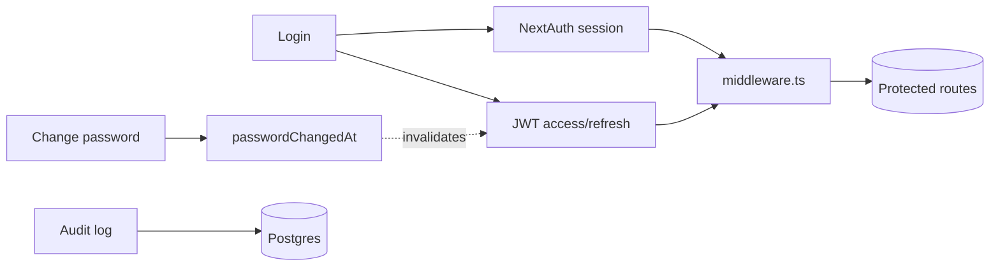

# Architecture

**BrandMonitorAI** — a core module of [ZeroShield](https://zeroshield.ai)

> Living doc. Update when a new pillar service is added. Companion overview: [`../README.md`](../README.md) · Docs index: [`README.md`](README.md)

## 1. Request flow

Rules that must not be broken:

1. The browser only ever talks to Next.js (port 9002). All backend calls are proxied via `/api/v1/*`.
2. Do **not** set `NEXT_PUBLIC_API_URL` — it breaks same-origin rewrites, per `brandmonitor1.txt`.
3. Every router that touches a Mongo collection must filter by `org_id` (Phase 4.1 — see `dependencies.py`).

## 2. Product pillars

Every feature is on one of these four pillars. If you can't place your feature, revisit the product brief.

### Brand protection

### Cyber-security monitoring

### AI assistance

### Operational trust

## 3. Directory map

| Path | Purpose |
|------|---------|
| `src/app/` | Next.js 15 App Router pages (12 modules + admin + auth) |
| `src/components/ui/` | shadcn primitives (added in Phase 1-2: `integration-banner`, `empty-state`, `clickable-row`) |
| `src/lib/serviceError.ts` | Typed error parsing for backend 503/429/422 responses |
| `src/lib/pdf/ReportDocument.tsx` | Shared PDF export template (Phase 3.4) |
| `src/middleware.ts` | Route protection (Phase 0.5) |
| `src/__tests__/` | Vitest suites |
| `orchestration-backend/api/main.py` | FastAPI entrypoint, router registration, global exception handling |
| `orchestration-backend/api/routers/*` | 22+ domain routers |
| `orchestration-backend/api/services/errors.py` | Typed service errors (Phase 1.1) |
| `orchestration-backend/api/services/alert_dispatcher.py` | Slack/Teams/Jira/email fan-out (Phase 3.3) |
| `orchestration-backend/api/dependencies.py` | `get_current_org` / `require_org` (Phase 4.1) |
| `orchestration-backend/api/tests/` | Pytest suites |
| `docs/` | Runbook, architecture, module status |
| `scripts/seed_demo.py` | Reproducible demo data |
| `.github/workflows/ci.yml` | Lint + typecheck + vitest + pytest + next build |

## 4. Where to add the next feature

| You want to… | Start at | Add tests in |
|---|---|---|
| New monitoring module (e.g. "Typosquat") | Create `src/app/<module>/page.tsx` + `orchestration-backend/api/routers/<module>.py`; register in `main.py` | `src/__tests__/<module>.test.tsx`, `orchestration-backend/api/tests/test_<module>.py` |
| New alert channel (e.g. PagerDuty) | Extend `alert_dispatcher.py` with `_send_pagerduty` and env config | `orchestration-backend/api/tests/test_alert_dispatcher.py` |
| New UI empty state | Use `<EmptyState />` | `src/__tests__/EmptyState.test.tsx` already covers it |
| New typed backend error | Subclass `ServiceError` in `services/errors.py` | `orchestration-backend/api/tests/test_errors.py` |
| New tenant-scoped query | Depend on `require_org` and add `org_id` to the Mongo filter | `orchestration-backend/api/tests/test_<router>.py` |
